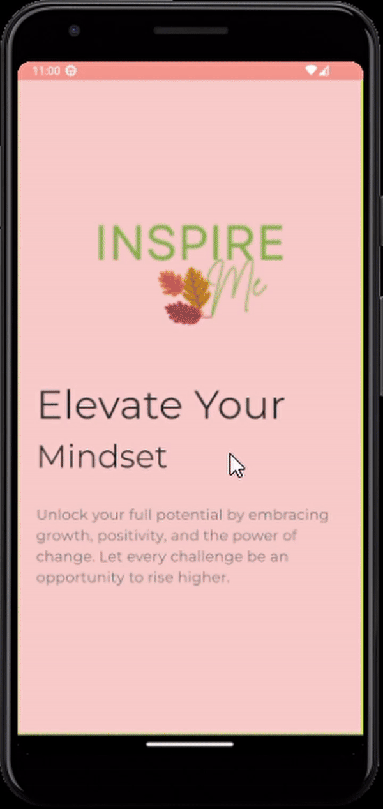

# InspireMe

InspireMe is a simple design project created as part of my Flutter daily challenge. This app features a carousel slider with beautiful visuals and swipe gestures, designed to evoke inspiration through its minimalist interface.

### Features:
- Carousel slider showcasing different designs
- Swipe gestures for seamless navigation
- Clean, responsive UI

---

### How to Use:
1. Clone the repository.
2. Open the project in your preferred Flutter IDE.
3. Run the project on an emulator or physical device.

---

### Preview:

---

This project is part of my learning journey to practice and improve my skills in Flutter design and development.
